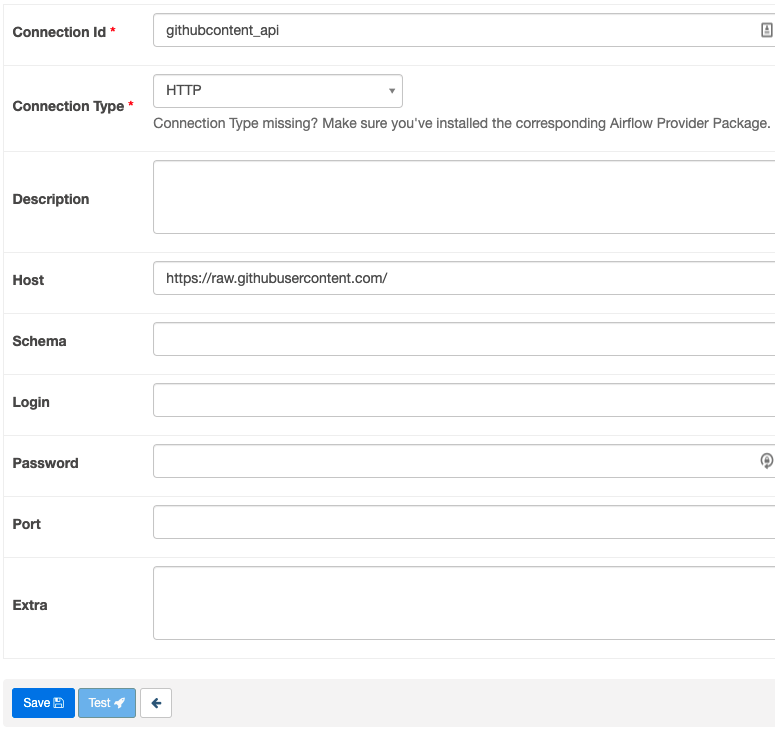

# Airflow

## Opensea API 오류시 대처법

오픈씨는 Cloudflare라는 서비스를 앞단에 두고 사용하는데 때문에 외부 콜을 랜덤하게 차단시킬 수 있습니다. ([관련 깃헙 쓰레드](https://github.com/ProjectOpenSea/opensea-js/issues/71))

만약 이로 인해 오류가 난다면 아래 방법을 써보세요. 

opensea connector대신에 제가 복제한 가짜 리스폰스를 사용하는 방법입니다.
가짜 리스폰스는 [여기](https://raw.githubusercontent.com/keon/data-engineering/main/02-airflow/nftresponse.json) 서 받아올겁니다.

1. 먼저 githubcontent_api 컨넥터를 만들어줍니다. 만드는 방식은 openapi_api 컨넥터를 만드는 방식과 같습니다.
컨넥터 이름으로는 `githubcontent_api`, Connection Type은 `HTTP`, Host는 `https://raw.githubusercontent.com/` 로 지정해주시면 되겠습니다.



2. 그리고 엔드포인트를 openapi의 `'api/v1/assets?collection=doodles-official&limit=1'` 대신  `'keon/data-engineering/main/02-airflow/nftresponse.json'`를 쓰시면 되겠습니다.

완성된 코드는 [github_nft_pipeline.py](./github_nft_pipeline.py)파일에서 확인이 가능합니다.


## CLI examples

```
airflow -h

airflow webserver

airflow db -h

airflow users -h

airflow users create -h

airflow users create -u admin -p admin -f Keon -l Kim -r Admin -e admin@admin.com

```

커맨드

```
이미 돌려본 커맨드
airflow db init 

airflow db upgrade

airflow db reset 

airflow webserver

airflow scheduler

airflow dags list

airflow tasks list example_trigger_target_dag

airflow dags trigger -e 20220-01-01 example_trigger_target_dag
```

